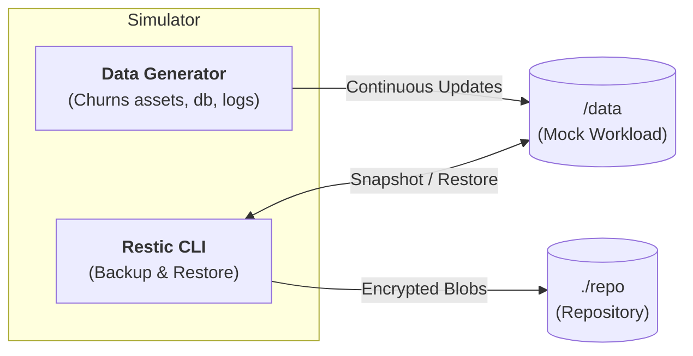

# 🛡️ Restic Playground

> **Master Restic through simulation, not documentation.**

---

### 🏗️ Architecture

---

### 🚀 Getting Started

| Step | Action | Command |
| :--- | :--- | :--- |
| **1** | Fire up the lab | `task up` |
| **2** | Start Training | `task menu` |
| **3** | Check Status | `task status` |

---

### 📚 Training Curriculum

| ID | Module | Mastery Command | Goal |
| :-- | :--- | :--- | :--- |
| **01** | **Initialization** | `restic init` | Create your first encrypted repository |
| **02** | **Snapshotting** | `restic backup` | Capture the state of agnostic data |
| **03** | **Inspection** | `restic ls`, `diff` | Compare snapshots and track changes |
| **04** | **Selective Recovery** | `restic restore --include` | Restore a single "accidentally" deleted file |
| **05** | **Total Recovery** | `restic restore latest` | Rebuild the entire world from scratch |
| **06** | **Optimization** | `restic forget`, `prune` | Implement retention and reclaim space |
| **07** | **Disaster Sim** | *Cold Restore* | Recover from a complete system wipe |

---

### 🕹️ Lab Controls

| Command | Function |
| :--- | :--- |
| `task status` | Real-time snapshot count & repo health |
| `task logs` | Follow data generator churn |
| `task reset` | **Wipe Data**: Simulates local data loss |
| `task wipe` | **Wipe Repo**: DANGER - Deletes all backups |
| `task down` | Kill the simulator |

---

### 📝 Logs
History of all executed restic commands: `logs/restic.log`